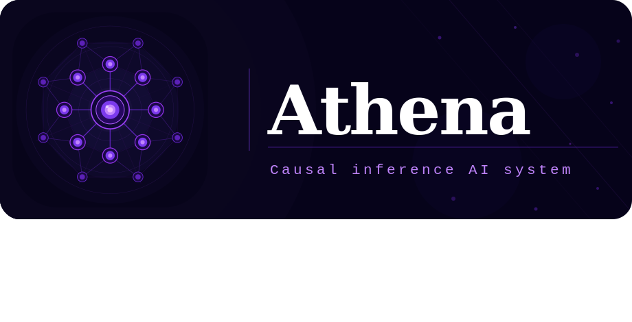

# Athena — 因果推論AIシステム

「なぜ◯◯が起きたのか」という因果的な問いに対し、AIが複数の仮説を自動生成・検証し、その思考プロセスをリアルタイムで**知識グラフ**として可視化するシステムです。

※より正確な表現については[システムの位置づけと実現可能性](./doc/jp/detail.md)を参照

## デモ


## セットアップ

### 前提条件

- Python 3.12+
- [Node.js 22+](https://nodejs.org/ja)
- [Docker](https://docs.docker.com/engine/install)

### 環境変数の設定&コンテナ起動

```bash
# .envの作成及び、APIキーの設定
cp .env.example .env

# Docker Composeで同時起動
# ※wsl利用の場合、DockerDesktopを起動した状態で実行してください
docker compose up -d

# ブラウザでシステムにアクセス
http://localhost:3000
```

## 主な機能

- ユーザーの問いからクエリ複雑度を判定し、使用モデル（Sonnet / Opus）を自動選択
- 3〜5個の因果仮説を自動生成
- Brave Search API によるWeb検索で証拠・反証を収集
- 因果グラフを構築し、フロントエンドに WebSocket でリアルタイム配信
- 最も蓋然性の高い仮説を根拠付きで提示
- トークン使用量・コスト（USD）の追跡と可視化

## 技術スタック

| レイヤー | 技術 | 役割 |
|---|---|---|
| フロントエンド | Next.js 15 + TypeScript | UI全体・設定画面 |
| グラフ描画 | D3.js (force-directed) | 知識グラフのインタラクティブ表示 |
| 状態管理 | Zustand | 認証・セッション・グラフ状態 |
| バックエンド | Django + Django Channels | REST API・WebSocket・認証 |
| 認証 | Django Auth + SimpleJWT | JWT認証・複数ユーザー管理 |
| AIパイプライン | LangGraph | 7ノード推論パイプライン制御 |
| LLM | Claude Sonnet / Opus（自動切替） | 仮説生成・証拠評価・推論 |
| Web検索 | Brave Search API | リアルタイム証拠収集 |
| ベクトルDB | PostgreSQL + pgvector | 埋め込みによる類似検索・重複排除 |
| 監視 | LangSmith | エージェント動作のトレース・評価 |

## ディレクトリ構成

```
athena/
├── backend/                    # Django バックエンド
│   ├── config/                 #   Django設定（settings, urls, asgi）
│   ├── causal/                 #   因果推論アプリ（モデル・API・WebSocket・パイプライン）
│   ├── users/                  #   認証・ユーザー設定アプリ
│   └── tests/                  #   バックエンドテスト
├── frontend/                   # Next.js フロントエンド
│   ├── app/                    #   ページ（ログイン・メイン・設定・新規登録）
│   ├── components/             #   UIコンポーネント（TopBar・ChatPanel・GraphPanel等）
│   ├── hooks/                  #   Zustandストア（認証・セッション・WebSocket・多言語）
│   └── lib/                    #   API通信・i18n翻訳
├── doc/                        # ドキュメント
│   ├── jp/                     #   日本語版（frontend・backend・db・docker）
│   └── en/                     #   英語版
├── moc/                        # 設計書・UIモックアップ
├── docker-compose.yml          # PostgreSQL + Redis コンテナ定義
├── pyproject.toml              # Python プロジェクト設定・依存パッケージ
├── init.sql                    # DB 初期化スクリプト（pgvector 拡張）
├── icon.svg                    # プロジェクトアイコン
├── banner.svg                  # README バナー画像
└── .env                        # 環境変数（APIキー・DB接続情報）
```

## LangGraph パイプライン（7ノード構成）

```
START
  │
  ▼
[ complexity_judge ]      ← クエリ複雑度を判定 → モデル（Sonnet/Opus）を選択
  │
  ▼
[ question_parser ]       ← 問いを構造化（主語・述語・時間軸を抽出）
  │
  ▼
[ hypothesis_generator ]  ← Claude で3〜5個の因果仮説を生成
  │
  ▼
[ evidence_searcher ]     ← Brave API から証拠・反証を収集
  │
  ▼
[ graph_builder ]         ← ノード・エッジを生成・pgvectorに保存
  │
  ▼
[ hypothesis_ranker ]     ← スコアリング（証拠数・質・矛盾度を総合評価）
  │
  ▼
[ answer_synthesizer ]    ← 最終説明文を根拠付きで生成
  │
  ▼
END  ← token_usage を DB に記録
```

## ドキュメント一覧

| 項目 | 機能 | 日本語版 | English |
|------|------|----------|---------|
| Frontend | ログイン画面 | [ログイン画面](doc/jp/frontend/01_login.md) | [Login Screen](doc/en/frontend/01_login.md) |
| Frontend | メイン画面 | [メイン画面](doc/jp/frontend/02_main.md) | [Main Screen](doc/en/frontend/02_main.md) |
| Frontend | 設定画面 | [設定画面](doc/jp/frontend/03_settings.md) | [Settings Screen](doc/en/frontend/03_settings.md) |
| Frontend | アカウント作成画面 | [アカウント作成画面](doc/jp/frontend/04_signup.md) | [Account Registration](doc/en/frontend/04_signup.md) |
| Backend | 認証 API | [認証 API](doc/jp/backend/01_auth.md) | [Authentication API](doc/en/backend/01_auth.md) |
| Backend | セッション API | [セッション API](doc/jp/backend/02_sessions.md) | [Sessions API](doc/en/backend/02_sessions.md) |
| Backend | WebSocket API | [WebSocket API](doc/jp/backend/03_websocket.md) | [WebSocket API](doc/en/backend/03_websocket.md) |
| Backend | 設定・使用量 API | [設定・使用量 API](doc/jp/backend/04_settings_usage.md) | [Settings & Usage API](doc/en/backend/04_settings_usage.md) |
| Database | PostgreSQL | [PostgreSQL](doc/jp/db/postgresql.md) | [PostgreSQL](doc/en/db/postgresql.md) |
| Database | Redis | [Redis](doc/jp/db/redis.md) | [Redis](doc/en/db/redis.md) |
| Docker | 運用ガイド | [Docker 運用ガイド](doc/jp/docker/docker.md) | [Docker Operations Guide](doc/en/docker/docker.md) |

## 参考ドキュメント

- [Anthropic Claude API](https://docs.anthropic.com/)
- [LangGraph](https://langchain-ai.github.io/langgraph/)
- [LangSmith](https://docs.smith.langchain.com/)
- [Brave Search API](https://api-dashboard.search.brave.com/app/documentation/web-search/get-started)

## コントリビューション

コントリビューションを歓迎します。以下の手順でお願いします：

1. このリポジトリを Fork します
2. フィーチャーブランチを作成します（`git checkout -b feature/your-feature`）
3. 変更をコミットします（`git commit -m '機能の説明'`）
4. ブランチを Push します（`git push origin feature/your-feature`）
5. Pull Request を作成します

バグ報告や機能リクエストは [Issues](https://github.com/yasutoshi-lab/Athena/issues) からお願いします。

## ライセンス

このプロジェクトは [Apache License 2.0](./LICENSE) のもとで公開されています。

Copyright 2026 yasutoshi-lab
